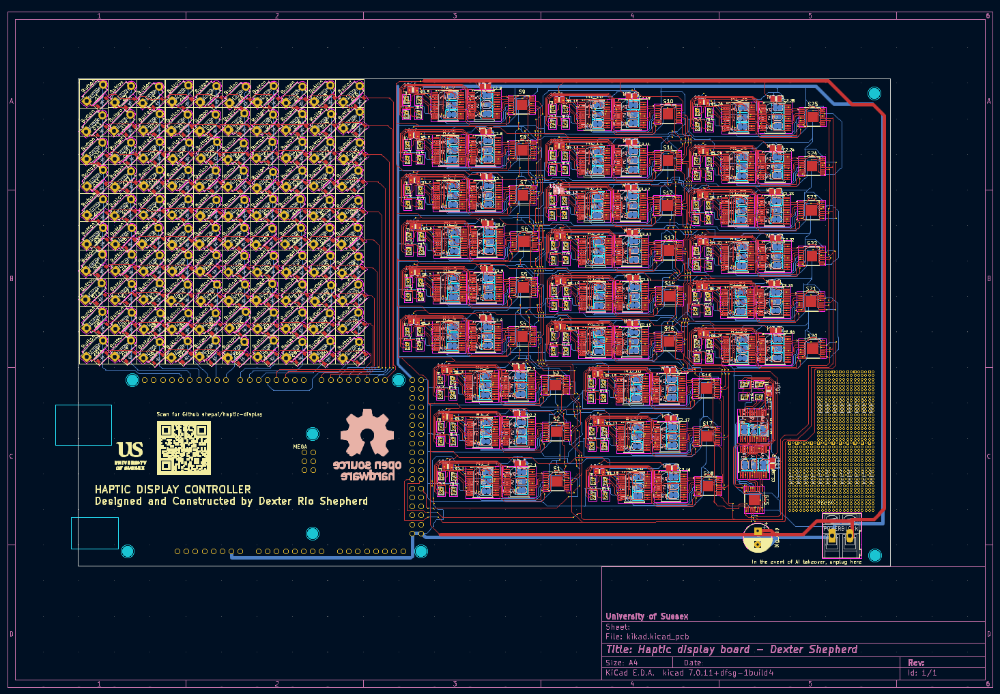

# haptic-display
Haptic display 3D files and code.

## Construction 
You will need to print off:
- 1 x <a href="https://github.com/shepai/haptic-display/blob/main/3D%20parts/haptic%20device.stl">Main body</a>
- 100 x <a href="https://github.com/shepai/haptic-display/blob/main/3D%20parts/slider.stl">motor holders</a>
- 100 x <a href="https://github.com/shepai/haptic-display/blob/main/3D%20parts/plate.stl">Plates</a>

In addition you will need to have the PCB manufactured. Listed is the schematics, BOM and placement files. 

Firstly print all the parts off, we recommmend using a resin printer for the high resolution quality, making sure everything fits. 

### PCB

To make the PCB you can use our existing GERBER file under <a href="https://github.com/shepai/haptic-display/blob/main/PCB/compiled.zip">compiled.zip</a> along with the BOM and placement file in the <a href="https://github.com/shepai/haptic-display/tree/main/PCB">same folder</a>. 

You can also make edits to the PCB by loading in the kicad file.

